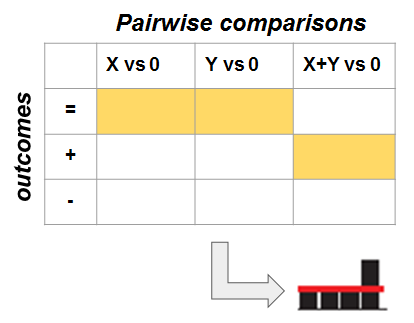

# Summary
This document illustrates the methods to build and use the classifier.
All the scripts are available from https://github.com/anto78/generating_training_set

### Profile codes
Each integration profile is coded as a vector of ternary values 0, -1, +1. Each ternary value corresponds to the outcome of a pairwise comparison among the conditions: 0, X, Y, X+Y, and ADD. ADD is the additivity value corresponding to the individual effects of X and Y. The codes corresponding to the different profiles are in the file 
*profile_codes_v2.txt*. Let's see how it works.

```{r}
PROFCODES = read.table("profile_codes_v2.txt",header = TRUE,sep = "\t")
PROFCODES[3,1:10]
```

<div style="width:800px; height=700px">

</div>

Consider the above row, corresponding to profile index 3. The first columns ADD.0 corresponds to the comparison between ADD and 0. The value of 0 means that, for this profile, the addivity line (ADD) and the control (0) are the same. The fourth column means that the expression level at X+Y is larger than the control (see Figure 1). 

For the above profile, all the comparisons involving the additive level
are redundant. However, there are cases in which two profiles can only be discriminated by including comparisons with the additive level. For example, let's consider the following two profiles:
```{r results='hide', message=FALSE, warning=FALSE}
#par(mfrow = c(1, 2))
source("setPowerPointStyle.R")
setPowerPointStyle()
X1=c(4,1,5,4)
X2=c(4,3,6,4)
add1=X1[1]+(X1[2]-X1[1])+(X1[3]-X1[1])
add2=X2[1]+(X2[2]-X2[1])+(X2[3]-X2[1])

barplot(X1,axes=FALSE)
abline(h=add1,col="red")
barplot(X2,axes=FALSE)
abline(h=add2,col="red")
```


### Simulating an integration profile
The profiles described above are abstract, qualitative possibilities. Let's say we want to generate numerical values that satisfy the inequalities corresponding to a given profile. This can be done using the code below.

#### Simulating mean expression for a given integration profile
```{r results='hide', message=FALSE, warning=FALSE}
load("constraints_vector")
source("compute_profile_means.R")
source("compute_minimum_delta.R")
source("setPowerPointStyle.R")
setPowerPointStyle()

prof_index=19 #index of profile to be simulated
ntimes=5 #n. of simulations
exp_min=2 #min range of expression value
exp_max=16 #max range of expression value
min_delta=0.5 #signal (minimum difference in expression between any two comparisons)
x=compute_profile_means(PROFCODES,prof_index,ntimes,exp_min,
                        exp_max,constraints_vector,min_delta)[,1:4]
colnames(x)=c("0","X","Y","X+Y")
head(x[,1:4])
barplot(x[1,],ylab='expression')
add=x[1,1]+(x[1,2]-x[1,1])+(x[1,3]-x[1,1])
abline(h=add,col="red")
```


#### Simulating random samples for a given inegration profile
After computing the means for a given profile, we can generate random samples resembling real data. We assume that real data come from normal distributions centered around the means computed above. The standard deviation is passed as a parameter, so it is possible to simulate  arbitrary noise levels.

```{r results='hide', message=FALSE, warning=FALSE}
source("simulate_from_means.R")
source("setPowerPointStyle.R")
setPowerPointStyle()

samples=4
noise_level=1
simulated_values=simulate_from_means(x[1,],prof_index,samples,
                                     noise_level,exp_min,exp_max)

design=factor(c(rep("0",samples),rep("X",samples),
                rep("Y",samples),rep("Y+X",samples)))

names(simulated_values)=c(rep('0',samples),rep('X',samples),
                          rep('Y',samples),rep('Y+X',samples))

simulated_values
boxplot(simulated_values~design,ylab='',
        outline=FALSE,col='gray',frame=F,axes=FALSE,medcol="white")
stripchart(simulated_values ~ design, vertical = TRUE, 
    method = "jitter", add = TRUE, pch = 20, col = 'black',cex=1.5)

```

An example with more noise.
```{r results='hide', message=FALSE, warning=FALSE}
source("setPowerPointStyle.R")
setPowerPointStyle()

noise_level=2
source("simulate_from_means.R")
simulated_values=simulate_from_means(x[1,],prof_index,samples,
                                     noise_level,exp_min,exp_max)

boxplot(simulated_values~design,ylab='',
        outline=FALSE,col='gray',frame=F,axes=FALSE,medcol="white")
stripchart(simulated_values ~ design, vertical = TRUE, 
    method = "jitter", add = TRUE, pch = 20, col = 'black',cex=1.5)

```

### Computing a vector of statistical features for a given simulated or experimental profile
Let's assume we have an integration profile in the form of N replicates for each of the conditions 0,X, Y, X+Y. We want to derive a set of statistical features, which will be used as predictors of the true profile in the automatic classifier. Such features consist of the Bliss index, the mean expression values in 0,X, Y, X+Y, and the p-values for all possible pairwise tests (one-tailed, two-tailed, t-test, Wilkoxon). In total, the are 75 variables. These can be computed with the function *match11* as shown below. 

```{r results='hide', message=FALSE, warning=FALSE}
source("match11.R")
source("setPowerPointStyle.R")
setPowerPointStyle()

profile.features=match11(simulated_values)
length(profile.features)
head(profile.features,10)
```

### Generating a training set with instances of all profiles and variable noise level
The classifier is based on a training set consisting of simulated data. Let's see how we can use the above functions to generate a training set containing all profiles. 

```{r,eval=F, echo=T,results='hide', message=FALSE, warning=FALSE}
source("setPowerPointStyle.R")
setPowerPointStyle()

#global parameters
ntimes=10 #how many times each profile is simulated
samples=4 #how many replicates/condition
expr_range=c(2,16) #expression range for simulations
min_delta=0.5
 
noise_range=c(0.2,0.4,0.6,0.8,1.0)
 
#n. of vars in the dataframe (75 features + class label)
NVAR=75 + 1
 
#initialize dataframe containing training set
big_simulation = data.frame()
  
for (h in 1:length(noise_range)){
  for (k in 1:123){
    
    temp = data.frame(matrix(ncol = NVAR, nrow = ntimes))
    temp[,1] = k
    mymeans = compute_profile_means(PROFCODES,k,ntimes,min(expr_range),
                                max(expr_range),constraints_vector,min_delta)[,-5]
    
    simulated = apply(mymeans,1,function(x) simulate_from_means(x,k,
                                                            samples,noise_range[h],
                                                            min(expr_range),
                                                            max(expr_range)))
    simulated = t(simulated)

    features = t(apply(simulated,1, match11))
    
    temp[,2:NVAR] = features
    
    big_simulation = rbind(big_simulation,temp)
  }
  
}

names(big_simulation) = c("TCIND",colnames(features))

save(big_simulation,file="big_simulation")


```

### Correlation among predictors

```{r results='hide', message=FALSE, warning=FALSE}
source("setPowerPointStyle.R")
setPowerPointStyle()

load("big_simulation")
dim(big_simulation)

#show histogram
hist(cor(big_simulation[,-1]),xlab='linear correlation',main="")
paired=which(abs(cor(big_simulation))==1, arr.ind=TRUE)
which(paired[,1]!=paired[,2],arr.ind = TRUE)
```

### Training the model
These lines of code will train a random forest classifier on the simulated data.
```{r,eval=F, echo=T,results='hide', message=FALSE, warning=FALSE}

rf_model=randomForest(as.factor(TCIND)~., data = big_simulation,importance=T)
save("rf_model",file = "rf_model")

```

### Testing the model on independent simulated datasets
To measure the classification accuracy of the classifier, we simulated
independent test sets with different levels of noise. We then assessed the fraction of correctly classified cases as a function of the profile and of the noise level.

```{r,eval=F, echo=T,results='hide', message=FALSE, warning=FALSE}
source("setPowerPointStyle.R")
setPowerPointStyle()

library(caret)
library(randomForest) 

load("rf_model")
load("test_20_pc")
load("test_40_pc")
load("test_100_pc")
load("test_200_pc")
tests=list(test_20_pc,test_40_pc,test_100_pc,test_200_pc)


RF_accuracy=list()


p=lapply(tests,function(x) predict(rf_model,newdata=x[,-1]))
  
conf=confusionMatrix(p[[1]],tests[[1]][,1])
  
#plotting
cols = c("black","red","blue")

RF_accuracy[[1]]=diag(conf$table)

plot(diag(conf$table),ylim = c(0,100),type = "l",
     xlab = "profile index",ylab = "% accuracy")

for (j in 2:3) {
  conf = confusionMatrix(p[[j]],tests[[j]][,1])
  lines(diag(conf$table),ylim = c(0,100),col = cols[j])
  RF_accuracy[[j]]=diag(conf$table)
  }
  
legend(2,35, # places a legend at the appropriate place
       c("20%","40%","100%"), # puts text in the legend
       lty = c(1,1,1), # gives the legend appropriate symbols (lines)
       lwd = c(2.5,2.5,2.5),col = cols,
       bty = "n")
  


#   legend(2,35, # places a legend at the appropriate place 
#          
#          c("20%","40%","100%","200%"), # puts text in the legend
#          
#          lty=c(1,1,1,1), # gives the legend appropriate symbols (lines)
#          
#          lwd=c(2.5,2.5,2.5,2.5),col=cols,
#          
#          bty = "n") 

```

#predict LDA
```{r,eval=F, echo=T,results='hide', message=FALSE, warning=FALSE}
source("setPowerPointStyle.R")
setPowerPointStyle()

library(caret)
#library(randomForest) 

load("lda_model")
load("test_20_pc")
load("test_40_pc")
load("test_100_pc")
load("test_200_pc")

tests=list(test_20_pc,test_40_pc,test_100_pc,test_200_pc)

p = lapply(tests,function(x)
  predict(lda_model,newdata = x[,-1]))
  
conf = confusionMatrix(p[[1]],tests[[1]][,1])
  
#plotting
cols=c("black","red","blue")

LDA_accuracy=list()

LDA_accuracy[[1]]=diag(conf$table)  

plot(diag(conf$table),ylim = c(0,100),type = "l",
     xlab = "profile index",ylab = "% accuracy")
  
for (j in 2:3) {
  conf = confusionMatrix(p[[j]],tests[[j]][,1])
  lines(diag(conf$table),ylim = c(0,100),col = cols[j])
  LDA_accuracy[[j]]=diag(conf$table)
  }
  

legend(2,35, # places a legend at the appropriate place
       c("20%","40%","100%"), # puts text in the legend
       lty = c(1,1,1), # gives the legend appropriate symbols (lines)
       lwd = c(2.5,2.5,2.5),col = cols,
       bty = "n"
       )
  
```


#predict KNN
```{r,eval=F, echo=T,results='hide', message=FALSE, warning=FALSE}
source("setPowerPointStyle.R")
setPowerPointStyle()

library(caret)
library(randomForest) 

load("knn_model")
load("test_20_pc")
load("test_40_pc")
load("test_100_pc")
load("test_200_pc")

tests=list(test_20_pc,test_40_pc,test_100_pc,test_200_pc)

p = lapply(tests,function(x) predict(knn_model,newdata = x[,-1]))
  
conf = confusionMatrix(p[[1]],tests[[1]][,1])

#plotting
cols = c("black","red","blue")
KNN_accuracy=list()

KNN_accuracy[[1]]=diag(conf$table)

plot(diag(conf$table),ylim = c(0,100),type = "l",xlab = "profile index",
     ylab = "% accuracy")

for (j in 2:3) {

  conf = confusionMatrix(p[[j]],tests[[j]][,1])
  lines(diag(conf$table),ylim = c(0,100),col = cols[j])
  KNN_accuracy[[j]]=diag(conf$table)
  KNN_accuracy[[j]]

  }

legend(2,35, # places a legend at the appropriate place
       c("20%","40%","100%"), # puts text in the legend
       lty = c(1,1,1), # gives the legend appropriate symbols (lines)
       lwd = c(2.5,2.5,2.5),col = cols,
       bty = "n")

```


```{r,eval=F, echo=T,results='hide', message=FALSE, warning=FALSE}
source("setPowerPointStyle.R")
setPowerPointStyle()

load("KNN_accuracy")
KNN_means=lapply(KNN_accuracy,median)

#plotting
cols = c("black","red","blue")

j=1
plot(KNN_accuracy[[j]],ylim = c(50,100),type = "l",xlab = "profile index",
     ylab = "% accuracy")

for (j in 2:3) {

  #conf = confusionMatrix(p[[j]],tests[[j]][,1])
  lines(KNN_accuracy[[j]],ylim = c(50,100),col = cols[j])

  }

# legend("topright", # places a legend at the appropriate place
#        c("20%","40%","100%"), inset=c(-0.5,0.),# puts text in the legend
#        lty = c(1,1,1), # gives the legend appropriate symbols (lines)
#        lwd = c(2.5,2.5,2.5),col = cols,
#        bty = "n")


```

<div style="width:800px; height=700px">

</div>


### Visualization
We developed a new way to visualize the outcome of large-scale X+Y experiments. We first grouped the profiles in "cases". Each case contains all profiles for which the individual effect of X and Y is fixed, and only the effect of X+Y changes. For example, consider the case for which X and Y individually do not have any effect. In this case, there are three possible qualitative effect for X+Y.

<div align="center" style="width:600px; height=700px">

</div>

Let's say that, in a large-scale experiment, we find 20 cases of A, 70 cases of B, and 10 cases of C. In terms of frequency, we have A: 0.2, B=0.7, C=0.1. We developed a new visualization technique that summarizes this information as follows:

```{r,results='hide', message=FALSE, warning=FALSE}
source("fancy.frequency.plots3.R")
source("setPowerPointStyle.R")
setPowerPointStyle()

response=c(10,70,20)
fancy.freq.plots3(1,response)
```

Altogether, there are 17 cases: three are symmetrical in X, Y and the remaining are not symmetrical in X, Y.

<div style="width:800px; height=1100px">

</div>


### Full example on how to analyze an X+Y dataset
We now want to analyze the dataset in the file **GSE16816_1.txt**.
https://www.ncbi.nlm.nih.gov/pubmed/24495868. It consists of CLL
cells stimulated by CDK9 and/or fludarabine. The dataset should be 
in the following format: the first two columns are Probe ID, and Gene Symbol. The remaining columns contain the data in the standard design of X+Y experiments, as above. It is assumed to have a balanced experiment, with the same number of samples in each of 0, X, Y, X+Y.


Processing Elena's immune dataset
```{r results='hide', message=FALSE, warning=FALSE,eval=FALSE}
immune_ds=read.table("IFN_TNF_Data_filtered_MinExp_OneProbe_Full.txt")
 
# #extract 1st dataset
# expr=immune_ds[,c(1:6,10:12,19:21)]
# my_dataset=data.frame(row.names(expr),row.names(expr),expr)
# row.names(my_dataset)=NULL
# names(my_dataset)[1:2]=c('probe','gene')
# write.table(my_dataset,file ='TNF_IFN_1.csv',sep="\t")
# # 
# # #extract 2st dataset
expr=immune_ds[,c(1:3,7:9,13:18)]
my_dataset=data.frame(row.names(expr),row.names(expr),expr)
row.names(my_dataset)=NULL
names(my_dataset)[1:2]=c('probe','gene')
write.table(my_dataset,file ='TNF_IFN_2.csv',sep="\t")

```

#quality controls
```{r results='hide', message=FALSE, warning=FALSE,eval=FALSE}
source("setPowerPointStyle.R")
setPowerPointStyle()

setwd("C:/Users/Test1/Desktop/X+Y_shiny")
data_file="TNF_IFN_2.csv"

my_data=read.csv(data_file,sep = '\t')
expr=my_data[,-(1:2)]

if (max(expr)>25) expr=log2(expr)

samples=dim(expr)[2]/4

design=c(rep("0",samples),rep("X",samples),
                rep("Y",samples),rep("Y+X",samples))

cols=c(rep("black",samples),rep("red",samples),
                rep("blue",samples),rep("yellow",samples))

cof=apply(expr,1,function(x) sd(x)/mean(x))
expr=expr[which(cof>0.05),]

my.pca <- prcomp(t(expr),center = TRUE,scale=TRUE)
 
plot(my.pca$x[,1],my.pca$x[,2],col=cols,
     xlab = "PC1",ylab = "PC2",pch=20,cex=1.5,main=data_file)

legend("topright", pch = 20, col=unique(cols), 
       legend = c("0","X","Y","X+Y"), bty='n',cex=1)

```

<div style="width:800px; height=900px">

</div>


<div style="width:800px; height=900px">

</div>


<div style="width:800px; height=900px">

</div>


<div style="width:800px; height=900px">

</div>

Before applying the classification algorithm, we pre-process the data
in two steps: 1) probes with low coefficient of variation are filtered out; 2) probes with minimum delta <0.5 are filtered out.

First step: filter probes with low coefficient of variation

```{r results='hide', message=FALSE, warning=FALSE}
# source("setPowerPointStyle.R")
# setPowerPointStyle()
# 
# my_data_proc=my_data[which(cof>0.05),]

```

Second step: filter probes with low signal (defined as min 
delta among all pairwise comparisons, on average)
```{r results='hide', message=FALSE, warning=FALSE,eval=FALSE}
source("setPowerPointStyle.R")
setPowerPointStyle()
setwd("C:/Users/Test1/Desktop/X+Y_shiny/training_classifier/documentation")

source("compute_minimum_delta_analysis.R")
my_data_proc=my_data
my_data_means=t(apply(my_data_proc[,-(1:2)],1,
                    function(x) tapply(x,design,mean)))

# my_data_means=t(apply(expr,1,
#                     function(x) tapply(x,design,mean)))

#my_data_deltas=apply(my_data_means,1,compute_minimum_delta_analysis)

my_data_deltas=apply(my_data_means,1,function(x) 
  compute_minimum_delta_analysis(x,0.5))

my_data_proc2=my_data_proc[which(my_data_deltas),]

head(my_data_proc2)
dim(my_data_proc2)
```

Now we apply the classification scheme to each gene in the 
dataframe *my_data_proc*.

```{r results='hide', message=FALSE, warning=FALSE,eval=FALSE}
source("setPowerPointStyle.R")
setPowerPointStyle()

library(caret)
library(randomForest)
source("match11.R")

load("rf_model")
#compute statistical features of gene 1

features=apply(my_data_proc2[,-(1:2)]+replicate(12, rnorm(dim(my_data_proc2[,-(1:2)])[1],sd=0.1)),1,match11)

predicted_classes=predict(rf_model,
                          newdata=data.frame(t(features)),
                          type = 'prob')

max_match=t(apply(predicted_classes,1,function(x)  
  c(max(x),which.max(x))) )

#save results
my_results_2.5h=my_data_proc2
my_results_2.5h$Profile=max_match[,2]
my_results_2.5h$match_score=max_match[,1]
save(my_results_2.5h,file="my_results_2.5h")

#free memory
rm(rf_model)
rm(features)
rm(my_data_means)
rm(predicted_classes)
```


Plotting frequency plots for a case of interest
```{r results='hide', message=FALSE, warning=FALSE}
# PROFCODES = read.table("profile_codes_v2.txt",header = TRUE,sep = "\t")
# 
# source("setPowerPointStyle.R")
# setPowerPointStyle()
# 
# source("fancy.frequency.plots3.R")
# cases=cbind(max_match,PROFCODES[max_match[,2],11:12])
# # 
# # #choose case
# my_case=1
# outcomes=rep(0,table(PROFCODES$case)[my_case])
# 
# outcomes[as.integer(names(table(cases[cases[,3]==my_case,4])))]=table(cases[cases[,3]==my_case,4])
# fancy.freq.plots3(my_case,outcomes)
# 
# 
# for (h in 1:17){
#   my_case=h
#   png(file = paste(paste("my_case",my_case,sep="_"),'.png',sep=""),
#     width = 400, height = 300)
#   outcomes=rep(0,table(PROFCODES$case)[my_case])
# 
# outcomes[as.integer(names(table(cases[cases[,3]==my_case,4])))]=table(cases[cases[,3]==my_case,4])
# 
#   fancy.freq.plots3(my_case,outcomes)
#   setPowerPointStyle()
#   dev.off()
# 
# }
# 
# 

```

### Emergent positive synergies for IFN & TNF
```{r results='hide', message=FALSE, warning=FALSE}
# source("setPowerPointStyle.R")
# setPowerPointStyle()
# 
# #length(which(max_match[,2]==3))
# 
# em_syn=which(max_match[,2]==86)
# 
# noquote(cbind(as.character(sort(my_data_proc2[em_syn,1]))))
# 
# j=em_syn[1]
# 
# #max_match[j,]
# #PROFCODES[j,]
# X=as.numeric(my_data_proc2[j,-(1:2)])
# boxplot(X~design,ylab='log2 expression (A.U.)',outline=FALSE,col='gray',main=my_data_proc2[j,1])
# stripchart(X ~ design, vertical = TRUE, 
#     method = "jitter", add = TRUE, pch = 20, col = 'orange',cex=1.5)
# 
# 
# 
# #by name
# my_name='TLR5'
# j=which(my_data_proc2$probe==my_name)
# X=as.numeric(my_data_proc2[j,-(1:2)])
# boxplot(X~design,ylab='log2 expression (A.U.)',outline=FALSE,col='gray',main=my_data_proc2[j,1])
# stripchart(X ~ design, vertical = TRUE, 
#     method = "jitter", add = TRUE, pch = 20, col = 'orange',cex=1.5)
# 

```


Example 1.
```{r results='hide', message=FALSE, warning=FALSE,eval=FALSE}
# source("setPowerPointStyle.R")
# setPowerPointStyle()
# 
# #check out TIRAP, HSH2D, BICD2, PPARGC1B, HDX
# j=1
# which.max(predicted_classes[j,])
# #max_match[j,]
# #PROFCODES[j,]
# 
# #X=my_data_proc2[j,-(1:2)]
# X=as.numeric(my_data_proc2[j,-(1:2)])
# boxplot(X~design,ylab='log2 expression',outline=FALSE,col='gray',main=my_data_proc2[j,1])
# stripchart(X ~ design, vertical = TRUE, 
#     method = "jitter", add = TRUE, pch = 20, col = 'orange',cex=1.5)


```

```{r echo=FALSE, results='hide', message=FALSE, warning=FALSE,eval=FALSE}
# source("compute_profile_means.R")
# source("setPowerPointStyle.R")
# source("compute_minimum_delta.R")
# load("constraints_vector")
# setPowerPointStyle()
# 
# prof_index=max_match[j,2] #index of profile to be simulated
# ntimes=50 #n. of simulations
# exp_min=2 #min range of expression value
# exp_max=16 #max range of expression value
# min_delta=0.5 #signal (minimum difference in expression between any two comparisons)
# x=compute_profile_means(PROFCODES,prof_index,ntimes,4,
#                         10,constraints_vector,1)[,1:4]
# colnames(x)=c("0","X","Y","X+Y")
# barplot(x[1,],axes=FALSE)
```


Example 2.
```{r results='hide', message=FALSE, warning=FALSE,eval=FALSE}
# source("setPowerPointStyle.R")
# setPowerPointStyle()
# 
# j=5
# #max_match[j,]
# #PROFCODES[j,]
# head(my_data_proc2)
# X=as.numeric(my_data_proc2[j,])
# boxplot(X~design,ylab='simulated values',outline=FALSE,col='gray')
# stripchart(X ~ design, vertical = TRUE, 
#     method = "jitter", add = TRUE, pch = 20, col = 'orange',cex=1.5)
```

```{r echo=FALSE,results='hide', message=FALSE, warning=FALSE,eval=FALSE}
# source("setPowerPointStyle.R")
# setPowerPointStyle()
# 
# PROFCODES = read.table("profile_codes_v2.txt",header = TRUE,sep = "\t")
# prof_index=max_match[j,2] #index of profile to be simulated
# ntimes=100 #n. of simulations
# exp_min=2 #min range of expression value
# exp_max=16 #max range of expression value
# min_delta=0.5 #signal (minimum difference in expression between any two comparisons)
# x=compute_profile_means(PROFCODES,prof_index,ntimes,3,
#                         10,constraints_vector,1)[,1:4]
# colnames(x)=c("0","X","Y","X+Y")
# head(x[,1:4])
# barplot(x[1,],axes=FALSE)

```


Example 3.
```{r results='hide', message=FALSE, warning=FALSE,eval=FALSE}
# source("setPowerPointStyle.R")
# setPowerPointStyle()
# 
# j=14
# max_match[j,]
# PROFCODES[j,]
# 
# X=as.numeric(my_data_proc2[j,-(1:2)])
# boxplot(X~design,ylab='simulated values',outline=FALSE,col='gray')
# stripchart(X ~ design, vertical = TRUE, 
#     method = "jitter", add = TRUE, pch = 20, col = 'orange',cex=1.5)
```

```{r echo=FALSE,results='hide', message=FALSE, warning=FALSE}
source("setPowerPointStyle.R")
# setPowerPointStyle()
# 
# prof_index=max_match[j,2] #index of profile to be simulated
# ntimes=50 #n. of simulations
# exp_min=2 #min range of expression value
# exp_max=16 #max range of expression value
# min_delta=0.5 #signal (minimum difference in expression between any two comparisons)
# x=compute_profile_means(PROFCODES,prof_index,ntimes,4,
#                         10,constraints_vector,1)[,1:4]
# colnames(x)=c("0","X","Y","X+Y")
# head(x[,1:4])
# barplot(x[1,],axes=FALSE)

#add=x[1,1]+(x[1,2]-x[1,1])+(x[1,3]-x[1,1])
#abline(h=add,col="red")

```

### Appendix 1: show all individual profiles
# Generating icons for all profiles
```{r results='hide', message=FALSE, warning=FALSE}

load("constraints_vector")
source("compute_profile_means.R")
source("compute_minimum_delta.R")
source("setPowerPointStyle.R")

setwd("C:/Users/Test1/Desktop/X+Y_shiny/training_classifier/documentation/drug_combo_app/www")

ntimes=10 #n. of simulations
exp_min=2 #min range of expression value
exp_max=16 #max range of expression value
min_delta=0.5 #signal (minimum difference in expression between any two comparisons)
colnames(x)=c("0","X","Y","X+Y")

for (k in 1:123){
  prof_index=k 
  x=compute_profile_means(PROFCODES,prof_index,ntimes,exp_min,
                          exp_max,constraints_vector,min_delta)[,1:4]
  
  add=x[1,1]+(x[1,2]-x[1,1])+(x[1,3]-x[1,1])
  if (add<exp_min) add=0.1
  if (add>exp_max) add=max(x[1,])+1.5
  
#  png(file = paste(paste("profile",prof_index,sep="_"),'.png',sep=""),
#      width = 400, height = 300)
  setPowerPointStyle()
  barplot(x[1,],ylab='',yaxt='n', ann=FALSE,col='black',main=paste('Profile',prof_index),ylim=c(0,max(x[1,])+1.6))
  abline(h=add,col="magenta",lwd=3)
#  dev.off()
}

```

